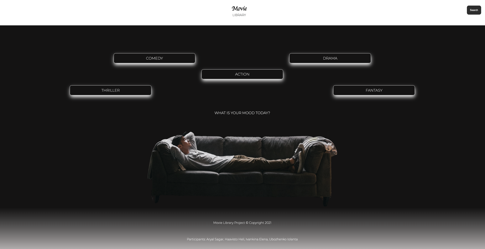
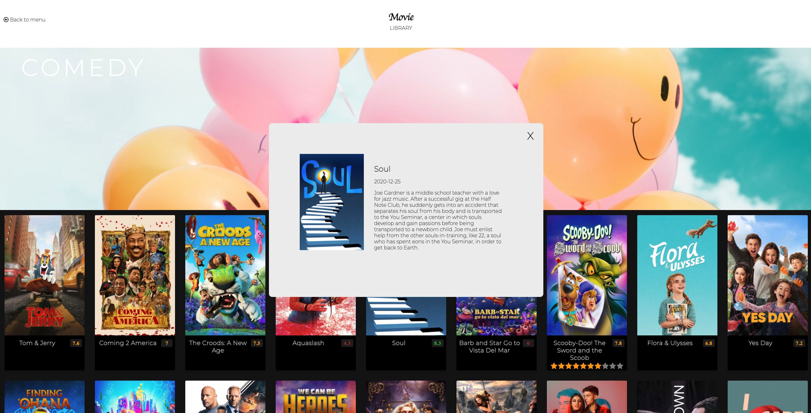

# Movie library project

This is a study project for Business College Helsinki.
Group: REACT21K
Year: 2021

[LINK TO THE PROJECT](https://elenaif.github.io/movie_library/index.html)

## Description

The website is a movie library. On the landing page a user can choose the category of movies he/she would like to watch. Website also has a search by the movie name.

## Technology

- HTML5
- CSS3
- JavaScript

## Creators:

- Aryal Sagar
- Haavisto Heli
- Ivankina Elena
- Ubozhenko Iolanta

## Media

